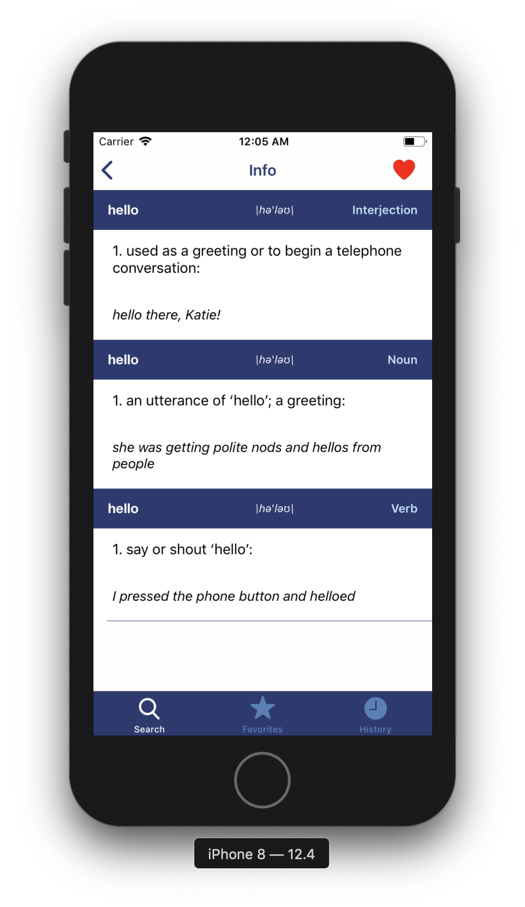
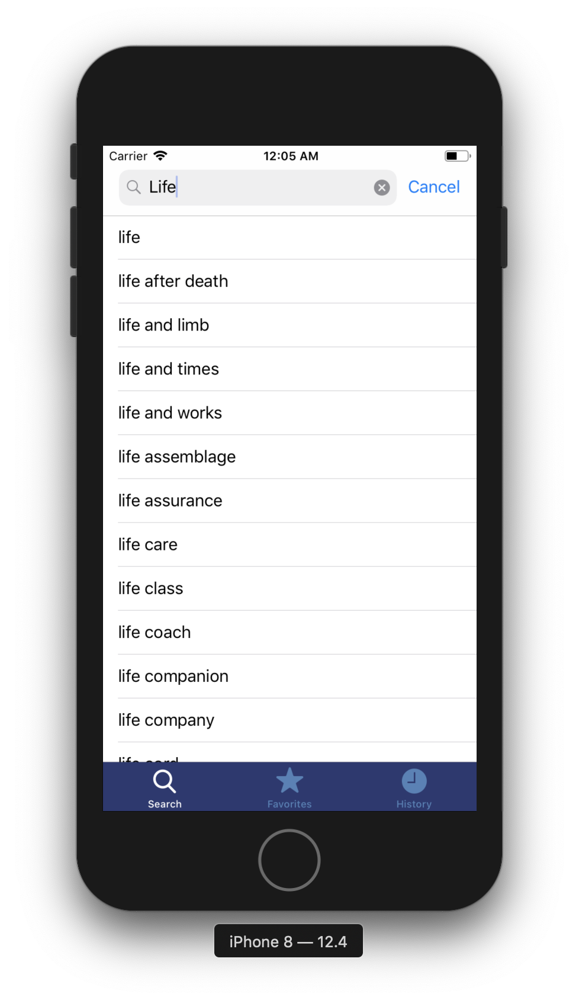
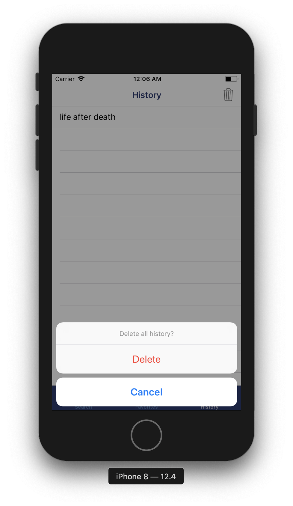
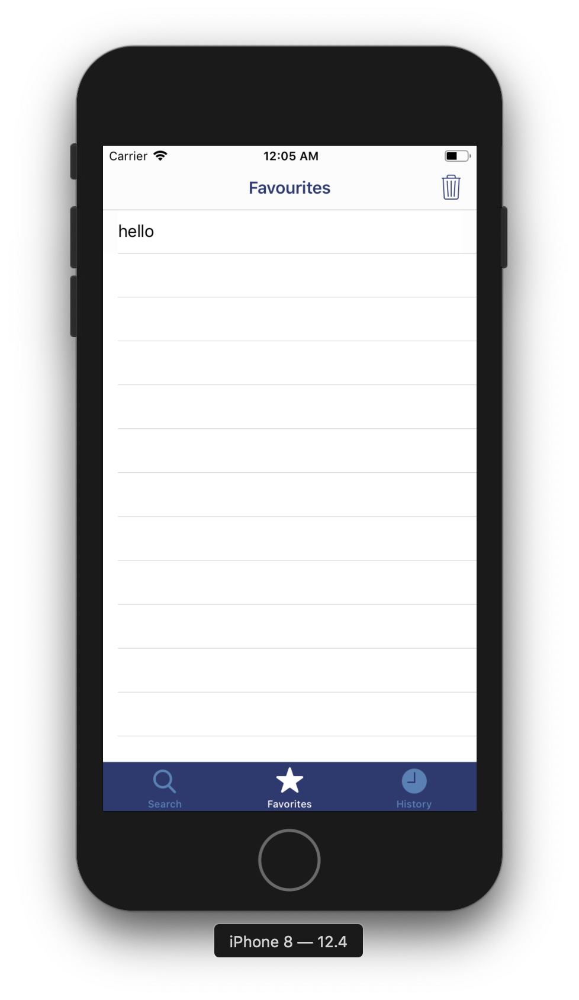

# Oxford Dictionary
Словарь с историей и избранными словами. Используется Oxford Dictionary api.  
К сожалению, с обновлением Oxford Dictionary api до версии 2.0 функция поиска стала платной из-за чего перестала на данный момент работать. Но если вы хотите проверить ее работоспособность, то просто напишите мне - suhomlinov.dev@gmail.com
# Скриншоты

   
